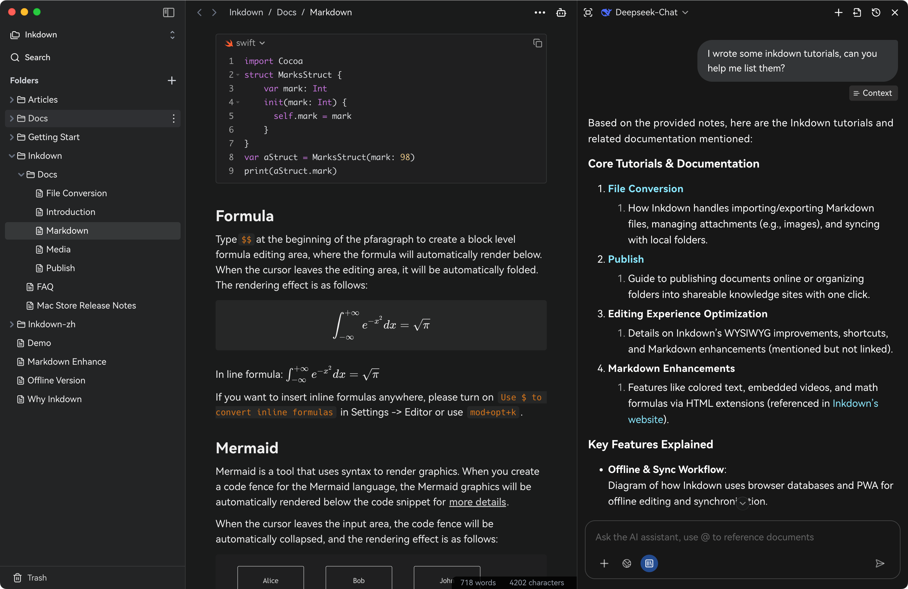
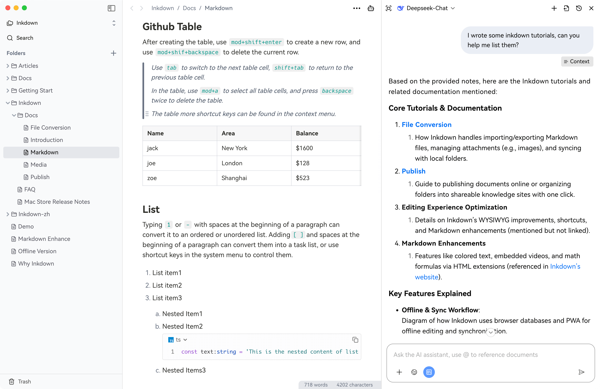
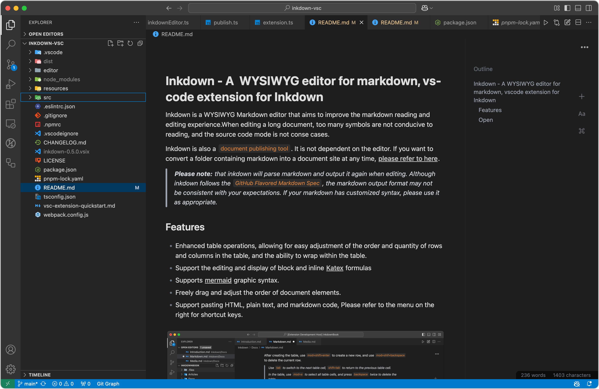
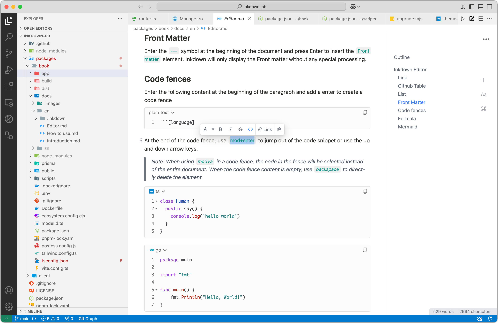

> **Core vs Premium:** These pages default to **Linkdown Core** (free, open source). Any feature that needs the proprietary **Linkdown-premium** module is marked with **“Linkdown Premium required”** or lives under [Premium & MCP](premium-mcp.html). Canonical wording: [SPEC_STANDARDS](https://github.com/fredporter/Linkdown-core/blob/main/docs/SPEC_STANDARDS.md) in Linkdown-core.

**Linkdown** is the maintained, AGPL-licensed fork of [Inkdown](https://github.com/1943time/inkdown) (WYSIWYG Markdown editor + optional LLM chat). It is developed by **Agent Digital** for macOS, Windows, and Linux (Electron).

- **Source code:** [Linkdown-core on GitHub](https://github.com/fredporter/Linkdown-core)  
- **Detailed technical docs** (same topics as the app repo): [docs tree](https://github.com/fredporter/Linkdown-core/tree/main/docs)  
- **Issues & feature requests:** [Linkdown-core issues](https://github.com/fredporter/Linkdown-core/issues)

## Screenshots (Inkdown lineage UI)

The images below are the same **Inkdown** marketing captures carried in the upstream and Linkdown repositories (desktop app and VS Code extension). Linkdown preserves this editing experience while extending the vault, tasks, and optional premium MCP layers.

### Desktop app

### VS Code extension

The upstream **Inkdown** VS Code extension remains a reference distribution; Linkdown focuses on the **desktop app** and vault workflows.

*Visual credits: screenshots originate from the [Inkdown](https://github.com/1943time/inkdown) project README (MIT-style upstream assets).*

## Support topics

| Topic | Description |
|--------|-------------|
| [Quick start](quick-start.html) | Open a vault, first note, optional LLM |
| [Interface overview](interface.html) | How the desktop UI maps to notes and preview |
| [Vault, lists & tasks](vault-and-tasks.html) | Binders, Task Forge, Obsidian-friendly habits |
| [Premium & MCP](premium-mcp.html) | Optional paid runtime and automation (high level) |
| [Get help](get-help.html) | Where to report bugs and read the manual |

## Editions

| Edition | What you get |
|---------|----------------|
| **Linkdown Core** | Free, AGPL — editor, vault, GFM + extensions, local index, OAuth to your own API providers |
| **Linkdown Premium** | Proprietary add-on — full MCP tool runtime, advanced publishing, and orchestration (see product docs when available) |

For terminology (GFM+Task, “vault” vs “workspace”) and **how we label Core vs Premium** in writing, see the core repo [SPEC_STANDARDS](https://github.com/fredporter/Linkdown-core/blob/main/docs/SPEC_STANDARDS.md) (section *Core vs Premium in documentation*).
